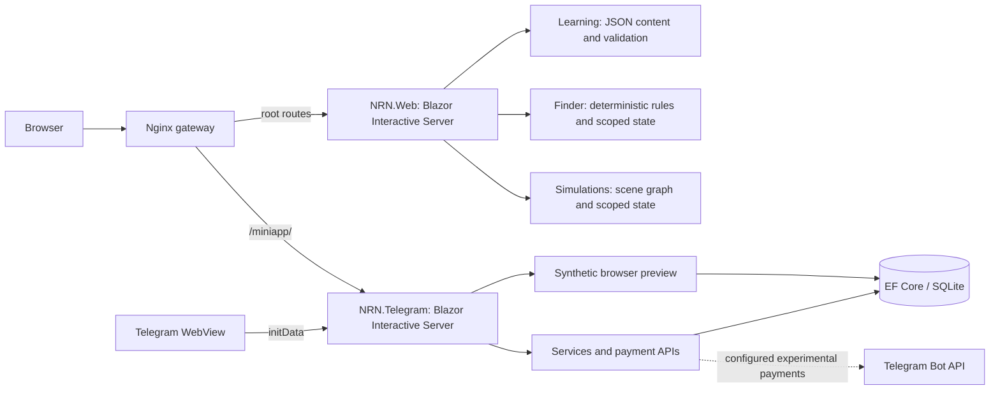

# NRN — Privacy-First Product Ecosystem

An independently developed, privacy-first product ecosystem exploring how education, practical tools and telecommunications services can work together. I took NRN from public product research and UX design to two working C# / ASP.NET Core applications: an educational web experience and a Telegram-oriented customer prototype.

[Live Demo](https://nrn-mvp.onrender.com) · [Source Code](app/NRNConcept/src) · [Architecture](docs/ARCHITECTURE.md) · [Product Research](docs/RESEARCH_TO_PRODUCT.md)

**Implemented:** Privacy Lab, Solution Finder and two interactive simulations. **Prototype:** Telegram Mini App and browser bot presentation.

**Independent concept. Not commissioned, approved or deployed by Narayana.** Real commercial accounts, service provisioning and authorized bot integration remain unfinished.

## Overview

People often encounter privacy tools before understanding the problem they solve. NRN starts with everyday situations, explains trade-offs and helps users choose a suitable next step. It addresses needs such as separating personal and work communication, staying connected while travelling and learning digital privacy.

Education remains useful without a purchase: Finder can return no suitable product and recommend learning instead.

## Try the product

| Experience | Demo | What works |
| --- | --- | --- |
| Privacy Lab | [Learning](https://nrn-mvp.onrender.com/learn) | Categories, articles, practical guidance and English/Russian content |
| Solution Finder | [Find a solution](https://nrn-mvp.onrender.com/finder) | Conditional questionnaire, recommendations, reasons and limitations |
| Interactive Simulations | [Explore scenarios](https://nrn-mvp.onrender.com/simulations) | Public Wi-Fi and Ordinary Day: decisions, consequences and restart |
| Telegram browser prototype | [Bot presentation](https://nrn-mvp.onrender.com/miniapp/demo) | Scripted conversation opens the Mini App with synthetic account data |

Render's free-tier services may take longer to load initially. Browser preview is not Telegram authentication. The Mini App's dashboard, catalog, services, account, help and language preferences are implemented; real backend integration and payments remain in development.

## Screenshots

Actual application screens from local published builds; Mini App data is synthetic.

| Privacy Lab | Solution Finder |
| --- | --- |
|  |  |
| **Interactive scenario** | **Telegram Mini App preview** |
|  |  |

## Technical stack

C# · .NET 9 · ASP.NET Core · Blazor Interactive Server · Razor components · JavaScript · HTML/CSS · EF Core / SQLite · xUnit v3 · Docker · Nginx · Render · GitHub Actions.

## Architecture



Education and customer identity have separate application boundaries. Learning, Finder and simulations share `NRN.Web`; `NRN.Telegram` owns prototype account data and Telegram integration. Each app reuses its own UI components, informed by common [design foundations](design/design-system.md). See [architecture](docs/ARCHITECTURE.md) for request flow, configuration and data boundaries.

## Engineering highlights

- **Turning research into product rules.** I translated privacy and usability findings into a conditional questionnaire with deterministic recommendations. Each result explains the user's need and the tool's limits; no-product outcomes keep education useful without forcing a sale.
- **Choosing what not to store.** I kept reading and learning choices in scoped memory instead of building an unnecessary account/profile database. This supports immediate access while avoiding persistent learning history.
- **Making content maintainable.** I separated educational content and simulation scenes into JSON resources, then implemented startup validators and tests for broken references and transitions. Content errors are detected before visitors encounter them.
- **Separating demonstration from identity.** I built a browser preview alongside server-side Telegram signature and freshness validation. Recruiters can explore the same Mini App screens with synthetic data while authenticated API calls derive identity from validated initData.
- **Protecting prototype account consistency.** I implemented transactional balance, purchase and subscription updates in SQLite, with tests for the ledger and payment idempotency. These are local prototype records; commercial provisioning remains unfinished.
- **Delivering two apps through one entry point.** I configured an Nginx gateway, path-base handling and WebSocket forwarding, then added CI for tests, publishing and Docker image builds. This makes the educational and Mini App surfaces accessible through one demo address.

## Product research & UX

My contribution spans competitor desk research, Jobs-to-be-Done hypotheses, user journeys, information architecture, visual foundations, implementation, automated tests and deployment setup. [Research-to-product traceability](docs/RESEARCH_TO_PRODUCT.md) connects findings to concrete choices: no educational registration, honest tool limitations and learning before purchase.

Explore the [research library](research/README.md), [user flows](design/user-flows.md) and [screen inventory](design/screen-list.md). The [original project documentation](docs/archive/README.md) is preserved in full alongside current implementation notes. Research hypotheses are distinguished from validated customer evidence.

## Privacy by design

Educational modules require no account and do not persist reading history or questionnaire/simulation choices. Blazor interactions still reach the server; framework cookies and infrastructure logs may apply. No analytics integration was found in the audited code.

The Mini App has a different boundary: language preferences persist in browser storage, and account/service/purchase records use SQLite. Real Telegram identity requires server validation. [Privacy and data handling](docs/ARCHITECTURE.md#privacy-and-data-boundaries) documents these distinctions.

## Run and test

Requirements: .NET 9 SDK and runtime. From the repository root:

```sh
dotnet restore app/NRNConcept/NRNConcept.sln
dotnet test app/NRNConcept/NRNConcept.sln --configuration Release --no-restore
```

**97 tests passed:** 55 Web and 42 Telegram. Tests cover content, simulation/Finder state, localization, identity validation and prototype storage. CI also publishes both applications and builds Docker images.

Follow [tested local setup](app/README.md) to launch the apps. [Verification](docs/VERIFICATION.md) and [deployment notes](docs/DEPLOYMENT.md) record infrastructure checks and remaining operational work.

## Next steps

Connect an authorized account/service backend, verify the Mini App and payments inside Telegram, expand educational scenarios with user feedback and refine component consistency.

NRN is an independent exploration and portfolio prototype. Commercial integration requires appropriate access and authorization; local purchase records do not provision telecommunications services.
