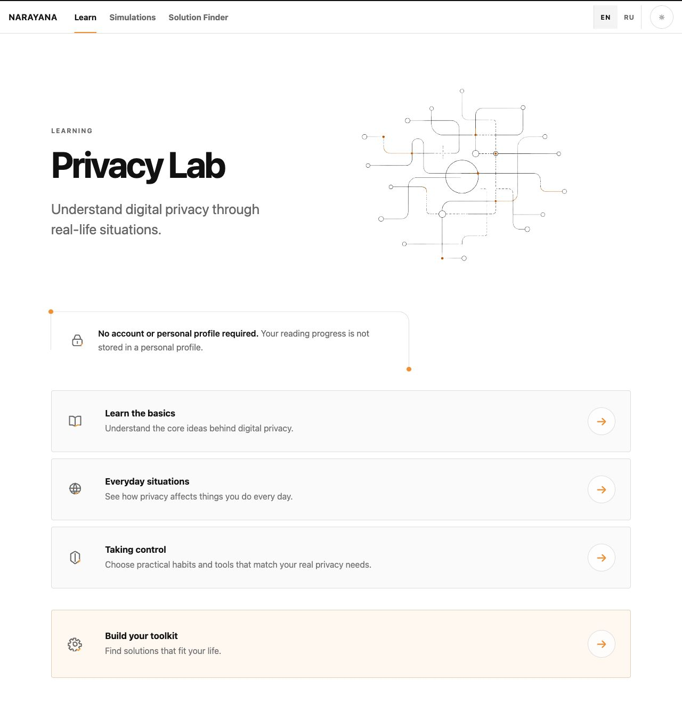
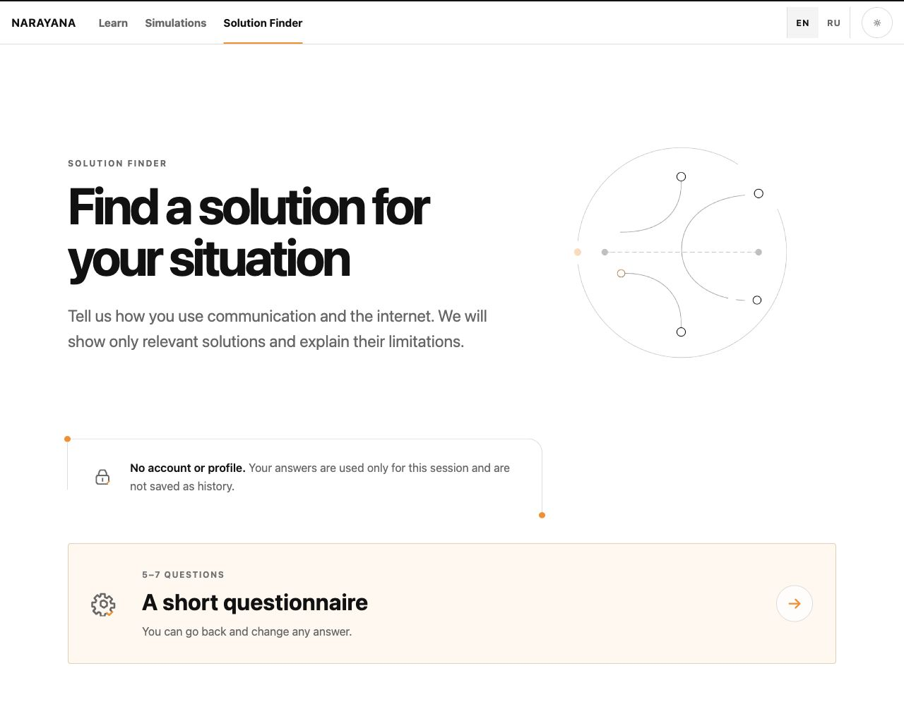
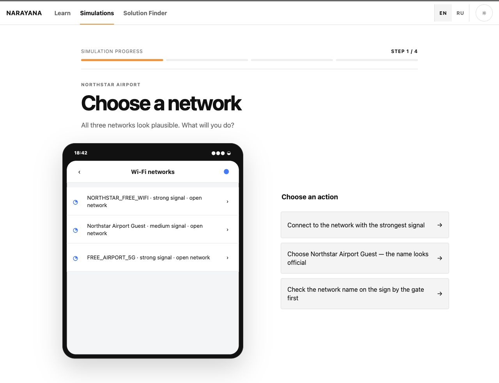
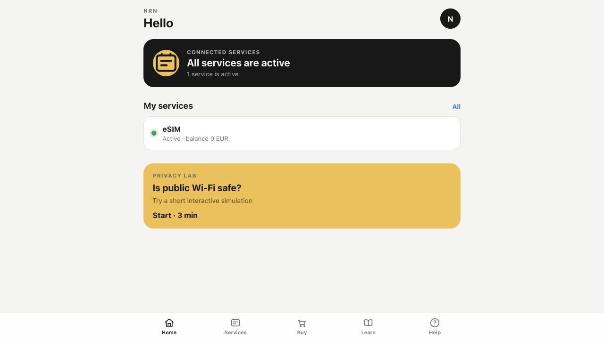
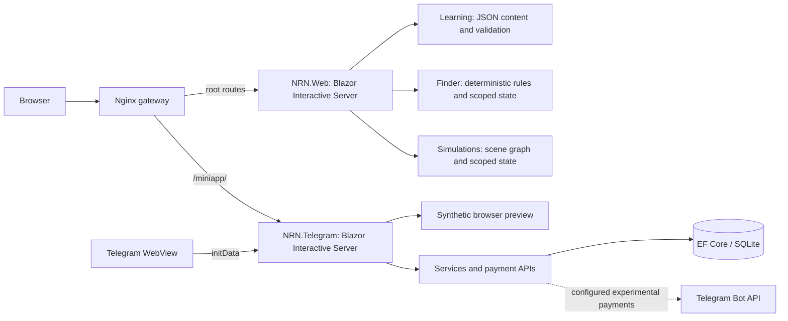

# NRN — Privacy-First Product Ecosystem

An independently developed, privacy-first product ecosystem exploring how education, practical tools and telecommunications services can work together. NRN turns public product research and UX design into two working C# / ASP.NET Core applications: an educational web experience and a Telegram-oriented customer prototype.

[Live Demo](https://nrn-mvp.onrender.com) · [Source Code](app/NRNConcept/src) · [Architecture](docs/ARCHITECTURE.md) · [Product Research](docs/RESEARCH_TO_PRODUCT.md)

**Implemented:** Privacy Lab, Solution Finder and two interactive simulations. **Prototype:** Telegram Mini App and browser bot presentation.

**Independent concept and MVP. Not commissioned, approved or deployed by Narayana.** Commercial accounts, provisioning and authorized bot integration remain unfinished.

## Overview

People often encounter privacy tools before understanding the problem they solve. NRN starts with everyday situations, explains trade-offs, then helps users identify a suitable next step. Its intended users include people separating personal and work communication, travelling, or learning basic digital privacy.

Education remains useful without a purchase: recommendations can return no suitable product and direct the user to learning instead.

## Live demo

| Experience | Try it | Status |
| --- | --- | --- |
| Privacy Lab | [Learning](https://nrn-mvp.onrender.com/learn) | Educational MVP |
| Solution Finder | [Find a solution](https://nrn-mvp.onrender.com/finder) | Guided questionnaire and recommendations |
| Interactive Simulations | [Explore scenarios](https://nrn-mvp.onrender.com/simulations) | Two decision-based stories |
| Telegram browser demo | [Bot presentation](https://nrn-mvp.onrender.com/miniapp/demo) | Synthetic conversation with an Open App entry point |

Verified on 9 October 2026. Render is configured on the free tier; initial loading can take longer while services wake up. The bot demo also returned a transient HTTP 429 during repeated checks; retry later if rate-limited. The bot presentation is scripted: its command buttons do not implement a real bot conversation. Browser preview is not Telegram authentication.

## Product ecosystem

| Module | Implementation | Remaining work |
| --- | --- | --- |
| Privacy Lab — **Implemented** | Category/topic pages, practical guidance, related tools, English/Russian content | Expanded content and continued editorial review |
| Solution Finder — **Implemented** | Five core questions, up to two follow-ups, deterministic recommendations, reasons and limitations | Further validation with users; no checkout in Finder |
| Interactive Simulations — **Implemented** | Public Wi-Fi and Ordinary Day, branching decisions, consequences, restart | Additional scenarios |
| Telegram Mini App — **In development** | Browser dashboard, catalog, services, account, help, language preferences; server authentication code | Authorized bot/WebView QA, authoritative accounts and service provisioning |
| Telegram payments — **In development / experimental** | Local SQLite purchase ledger and Stars invoice/webhook code | Configured prices, authorized integration and end-to-end verification |

## Screenshots

Actual local application screenshots from the audited source, using synthetic Mini App data.

| Privacy Lab | Solution Finder |
| --- | --- |
|  |  |
| **Interactive scenario** | **Telegram Mini App preview** |
|  |  |

## Technical stack

C# · .NET 9 · ASP.NET Core · Blazor Web Apps with Interactive Server rendering · Razor components · JavaScript · HTML/CSS · EF Core 9 / SQLite (Mini App) · xUnit v3 · Dockerfiles · Nginx gateway · Render blueprint · GitHub Actions.

The Telegram surface uses the official JavaScript Web App bridge. There is no TypeScript application, MVC controller layer or shared compiled component library.

## Architecture



Two application boundaries separate education from identity and account data. Educational modules share `NRN.Web`; they are feature folders, not separate services. UI components are reused within each app, while [design tokens and icons](design/design-system.md) provide common visual foundations. Configuration controls HTTPS redirection, Mini App path base, database location and optional Telegram/payment secrets. [Architecture and privacy boundaries](docs/ARCHITECTURE.md) document the details.

## Engineering highlights

| Problem | Technical decision | Benefit |
| --- | --- | --- |
| Educational JSON can contain broken references | Content validators run before Web starts; tests validate production resources | Invalid content fails early |
| Recommendations must explain their relevance | Deterministic rules, conditional questions and explicit limitations | Results can be traced to answers, including no-product outcomes |
| Learning should not create an unnecessary profile | Scoped in-memory state without an educational database | No persistent reading history or questionnaire profile |
| Browser demonstrations must not impersonate Telegram users | Separate preview API and server-side HMAC/freshness validation for real initData | Synthetic identity stays distinct from authenticated sessions |
| Local purchases must keep account state consistent | Transactional SQLite balance, purchase and subscription updates; payment charge idempotency | Tested consistency for the prototype ledger |
| Two apps must work through one public address | Nginx routing, forwarded headers, Mini App path base and WebSocket forwarding | One gateway preserves application routes and server interactivity |

These are implementation decisions, not claims of comprehensive security, production readiness or measured performance gains.

## Product research & UX

The developer's contribution spans public competitor research, problem framing, Jobs-to-be-Done hypotheses, user journeys, information architecture, UI foundations, C# implementation, tests and deployment configuration. This is an independent portfolio project, not evidence of ownership of Narayana's products or systems.

[Research-to-product traceability](docs/RESEARCH_TO_PRODUCT.md) connects decisions to sources: privacy education requires no account; tool cards explain limitations; Finder can recommend learning instead of a purchase. [The research library](research/README.md) distinguishes desk research from validated customer evidence. [User flows](design/user-flows.md), [screen inventory](design/screen-list.md) and [design system](design/design-system.md) show how the concept became an interface. Iterative prototypes and two implemented scenarios demonstrate prioritization; no measured conversion improvement is claimed.

## Privacy by design

| Data boundary | Educational Web | Telegram Mini App |
| --- | --- | --- |
| Registration | Not required | Browser preview needs none; real sessions validate Telegram identity |
| Reading history / choices | Not persisted; choices remain in the server-side circuit | Account/service/purchase records use SQLite |
| Cookies / browser storage | No custom educational tracking storage found; framework antiforgery may use cookies | Language saved in localStorage and `nrn.language` cookie; framework cookies may also apply |
| Analytics | No analytics integration found in audited code | No analytics integration found in audited code |
| Server communication | Blazor sends UI interactions over its server connection; IP/request metadata may be logged | initData reaches the server; authenticated IDs, balances, subscriptions and payments can be stored |
| Third parties | External links only; following them leaves NRN | Official Telegram JS loaded; support links and configured payment calls involve external services |

“No saved learning profile” does not mean “no data reaches a server” or “anonymous infrastructure.” Browser preview uses synthetic user `0` in the local database; demo purchases can persist and be visible across preview sessions. See [data boundaries](docs/ARCHITECTURE.md#privacy-and-data-boundaries).

## Running locally

Requirements: a .NET 9 SDK and runtime for native execution. The tested commands from the repository root are:

```sh
dotnet restore app/NRNConcept/NRNConcept.sln
dotnet test app/NRNConcept/NRNConcept.sln --configuration Release --no-restore
dotnet publish app/NRNConcept/src/NRN.Web/NRN.Web.csproj --configuration Release --no-restore --output /tmp/nrn-lab
dotnet publish app/NRNConcept/src/NRN.Telegram/NRN.Telegram.csproj --configuration Release --no-restore --output /tmp/nrn-miniapp
```

Dependency restore and the commands above succeeded on the audit host. Published launch instructions, URLs, Docker prerequisites and host troubleshooting are recorded in [local setup](app/README.md). Browser preview does not require a bot token. The Mini App applies migrations and seeds its local database at startup.

The checked-in Compose setup exposes the gateway on port 8080. Its configuration was validated, but container startup was not tested because the available host has no running Docker daemon. This limitation is explicit in [deployment notes](docs/DEPLOYMENT.md).

## Testing

`NRN.Web.Tests` and `NRN.Telegram.Tests` use xUnit v3. On 9 October 2026, **97 tests passed**: 55 Web and 42 Telegram, with zero skips. Tests cover content validation, simulation state, Finder rules/state, localization, Telegram signature validation, service API clients, SQLite migrations/purchases and payment-store behavior. They do not establish comprehensive browser accessibility, production payments or real Telegram WebView coverage.

[CI](.github/workflows/ci.yml) defines restore, tests, both app publishes and Compose image builds. Local results are detailed in the [verification report](docs/VERIFICATION.md).

## Roadmap

- Connect accounts and service lifecycle to an authorized, authoritative backend.
- Verify the Mini App inside Telegram and its configured payment flow.
- Add educational content and simulations informed by user feedback.
- Refine consistency between the two apps' design components.

## Project status & disclaimer

NRN is an independent concept and prototype developed for exploration and demonstration. It is not an official Narayana production application. Narayana references identify the product research context; they do not imply endorsement, employment, commissioning or deployment. Commercial service integrations require appropriate access and authorization. Local balances, subscriptions and purchase records do not provision telecom services.

## License

Licensed under [MIT](LICENSE), selected by the repository owner. Narayana names and third-party branding do not imply endorsement or transfer third-party rights.
